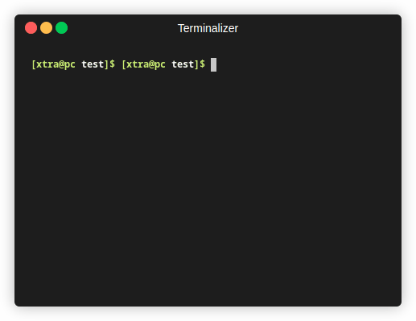

# clai 🧞

> Your command line, clarified.

`clai` is a command-line tool that uses DeepSeek AI to translate your natural language requests into executable shell commands. Never forget a complex `find` or `tar` command again.



## Overview

Tired of searching for the right command-line syntax on Stack Overflow? `clai` brings the power of a large language model directly to your terminal. It analyzes your request, considers your operating system context (like package managers), and proposes the most suitable command. For safety, it asks for your confirmation before executing anything.

## Features

* **Natural Language to Command:** Convert requests like "find all files larger than 100MB in my home directory" directly into a working command.
* **Interactive Confirmation:** Prevents accidental execution by showing you the command and asking for approval first.
* **Explain Commands:** Use the `--explain` flag to get a clear breakdown of what a command does, instead of running it.
* **Command History:** Keep a log of all successfully executed commands for future reference with `--history`.
* **System-Aware:** The tool sends your OS distribution and available tools as context to the AI for more accurate commands (e.g., `apt` on Debian vs. `dnf` on Fedora).
* **Self-Contained:** The installer creates a dedicated virtual environment, so it won't interfere with your system's Python packages.
* **Man Page Included:** A full `man ai` page is installed for quick reference.

## Installation

You can install `clai` with a single command. It will handle creating the necessary files, setting up a virtual environment, and placing the `ai` executable in `/usr/local/bin`.

The script will prompt you for your `sudo` password to complete the installation.

```sh
curl -sL https://raw.githubusercontent.com/XtraCore/clai/main/install.sh | sudo bash
```

## Configuration

After installation, you **must** configure your API key.

1.  Open the configuration file created by the installer:
    ```sh
    nano ~/.config/ai/config.ini
    ```
2.  Replace `YOUR_API_KEY_HERE` with your actual [Deepseek API key](https://platform.deepseek.com/api_keys).

    ```ini
    [API]
    key = YOUR_API_KEY_HERE
    model = deepseek-chat

    [Settings]
    timeout = 20
    ```

## Usage

The installed command is `ai`.

#### Basic Query

```sh
$ ai what is my local ip address

Proposed command:

  ip -4 addr show | grep -oP '(?<=inet\s)\d+(\.\d+){3}'

Execute this command? [Y/n] y
🚀 Executing...
192.168.1.10
```

#### Explaining a Command

```sh
$ ai --explain "tar -czvf archive.tar.gz /path/to/dir"

Command:
 `tar -czvf archive.tar.gz /path/to/dir`

Explanation:
This command creates a compressed archive file.

- `tar`: The main command, used for creating and manipulating tape archives.
- `-c`: Create a new archive.
- `-z`: Compress the archive using `gzip`.
- `-v`: Verbosely list the files processed.
- `-f`: Specifies the filename of the archive to be created (`archive.tar.gz`).
```

#### Executing without Confirmation

Useful for scripts or when you're feeling confident.

```sh
$ ai -y update my system packages
```

#### Viewing History

```sh
$ ai --history

ip -4 addr show | grep -oP '(?<=inet\s)\d+(\.\d+){3}'
sudo apt update && sudo apt upgrade -y
```

#### Getting Help

```sh
$ ai --help
# or for more detail
$ man ai
```

## Acknowledgments

* This tool is powered by the [Deepseek AI](https://www.deepseek.com/) API.

